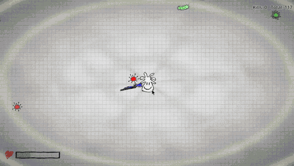

# 🐛 STROOPY

A top-down arcade shooter built around a **double Stroop effect** — where reading and reacting fight each other at every moment.

> Project demo is currently available on: 
https://stroopy.viperr.vip 

## What is the Stroop Effect?

The [Stroop effect](https://en.wikipedia.org/wiki/Stroop_effect) is a classic cognitive phenomenon: when the *name* of a color is printed in a *different* color ink, your brain takes longer to process it. Reading is automatic — it hijacks your attention before you can act on the actual visual stimulus.

## How STROOPY uses it — twice!

Every few seconds a word flashes on screen. It has two independent attributes:

| Attribute | Meaning |
|-----------|---------|
| **The word itself** | Which color of enemy to shoot |
| **The ink color** | Which weapon color to use |

These two are deliberately mismatched ~75% of the time. So when you see **BLUE**, you need to shoot **blue** enemies with your **red** weapon — while your brain screams at you to do the opposite.

This creates a *double* Stroop conflict: one between word and ink, and one between the two simultaneous decisions you need to make under pressure!!!

## Mechanics

**Core loop**
- Enemies swarm you in waves. Shoot the correct color with the correct weapon — wrong shots deal damage to *you* instead of the enemy.
- Non-target enemies act as **healers**: let them touch you and they restore HP, then vanish.

**Player movement**
- WASD movement with acceleration/friction smoothing
- **Shift sprint** with a stamina system — drain it fully and you enter an exhausted state until it partially recovers
- **Space dash** with a charge system, i-frames, and ghost trail effect
- **Perfect dodge**: dashing through an enemy at close range refunds cooldown and grants a bonus charge
- **Kill chain**: finishing an enemy shortly after a dash rewards another dash charge

**Spawner & difficulty**
- Calm/burst phase cycle — spawner alternates between relaxed trickle and frenzied pushes
- Enemies scale in speed over time
- Spawn patterns: single jab, arc, flanking line, encircling ring
- A **safe cone** behind the player's movement direction is biased away from spawns — you won't get ambushed face-first
- **Pity healer**: if you're low HP and haven't seen a healer in a while, the spawner guarantees one
- **Stroop bias**: right after a new prompt appears, target-colored enemies spawn more often — punishing you for hesitating

**Weapon wheel**
- Hold `Tab` to open, cursor position selects one of four colored weapons
- Also controllable with arrow keys

**Juice & feel**
- Slow-motion halftime effect on every new Stroop prompt (with halftone ink shader)
- Dash ghosts, hit flashes, invulnerability flicker
- Enemy death burst particles using the enemy's own sprite as texture
- Spawn telegraphs: pulsing circle indicators before enemies appear
- Doodle-style HP bar drawn entirely in `_draw()` with hand-sketched outlines and hatch fill
- Animated main menu with flowing ink shader background and cycling rainbow title

## Controls

| Input | Action |
|-------|--------|
| WASD | Move |
| Shift | Sprint |
| Space | Dash |
| Tab (hold) | Weapon wheel |
| LMB | Shoot |

## Run

Open in Godot 4.6+, hit Play.

The project is also crossplatformy buildable (Windows, MacOS, Web) via _Godot Platform Tools_. 

## Contributors

- **Artem Shchur** — team lead, base architecture, graphics elements
- **Serhii Drovovozov** — cognitive design, base architecture, project presentation
- **Andrew Meshko** — lead programmer & chief instigator
- **Ivan Romanko** — concept & idea, main graphics, sound design, effects & GUI, invaluable and probably the most important contribution to the project's realization